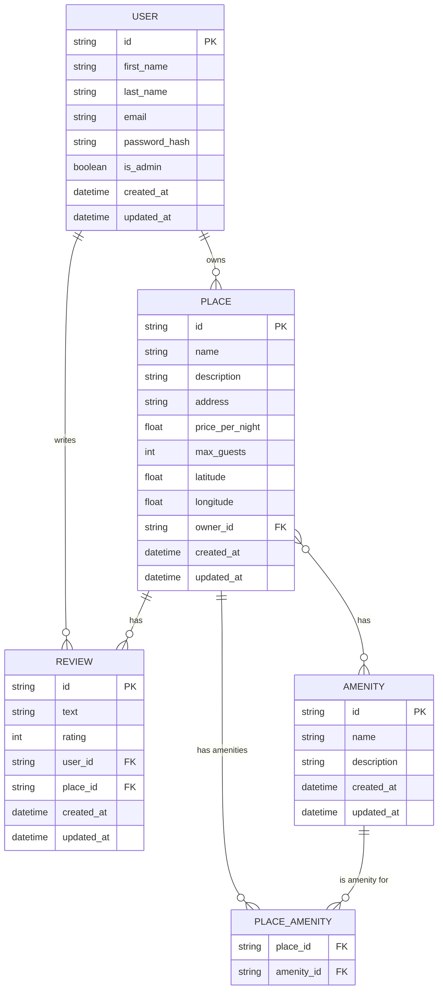

# HBnB - Auth & DB

## Description

HBnB is a REST API to manage users, places, reviews, and amenities. It uses Flask, SQLAlchemy, and JWT for authentication. Data is stored in SQLite (development) or MySQL (production).

## Requirements

- Python 3.8+
- pip
- SQLite (default)
- (Optional) MySQL for production

## Installation

1. Clone the repository:
   ```bash
   git clone <repo_url>
   cd holbertonschool-hbnb/part3
   ```
2. Create and activate a virtual environment:
   ```bash
   python3 -m venv venv
   source venv/bin/activate
   ```
3. Install dependencies:
   ```bash
   pip install -r requirements.txt
   ```

## Configuration

- Set environment variables if you want to customize:
  - `SECRET_KEY`
  - `DATABASE_URL` (default is SQLite)
  - `JWT_SECRET_KEY`
- By default, the environment is development. To change it:
  ```bash
  export FLASK_ENV=production
  ```

## Initialize the database

- For development, you can use the SQL script:
  ```bash
  sqlite3 hbnb_dev.db < schema_and_seed.sql
  ```
- Or use Alembic migrations:
  ```bash
  flask db upgrade
  ```

## How to run the app

```bash
python run.py
```

By default, it runs at `http://127.0.0.1:5000/`

## API Documentation

- Swagger UI: [http://127.0.0.1:5000/swagger-ui](http://127.0.0.1:5000/swagger-ui)
- Main endpoints:
  - `/api/v1/auth/login` (POST): Login, returns JWT
  - `/api/v1/places` (GET, POST): List and create places
  - `/api/v1/reviews` (GET, POST): List and create reviews
  - `/api/v1/admin/users` (GET, POST): Manage users (admin only)
  - `/api/v1/amenities` (GET, POST): Amenities

## Usage Example

1. Login:
   ```bash
   curl -X POST http://127.0.0.1:5000/api/v1/auth/login \
     -H 'Content-Type: application/json' \
     -d '{"email": "admin@hbnb.io", "password": "admin1234"}'
   ```
   Save the `access_token` you get.

2. Access a protected endpoint:
   ```bash
   curl -X GET http://127.0.0.1:5000/api/v1/places \
     -H 'Authorization: Bearer <access_token>'
   ```

## Testing

- If you have tests, you can run them like this:
  ```bash
  pytest
  ```

---

## Entity-Relationship Diagram (ERD)

The diagram below shows the main entities and their relationships. You can view it in the [Mermaid Live Editor](https://mermaid.live/).


